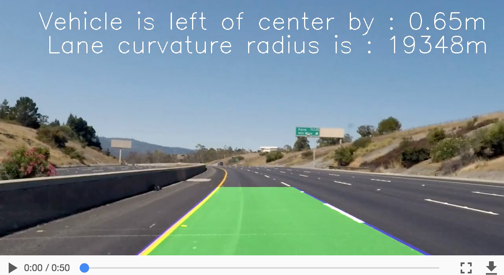
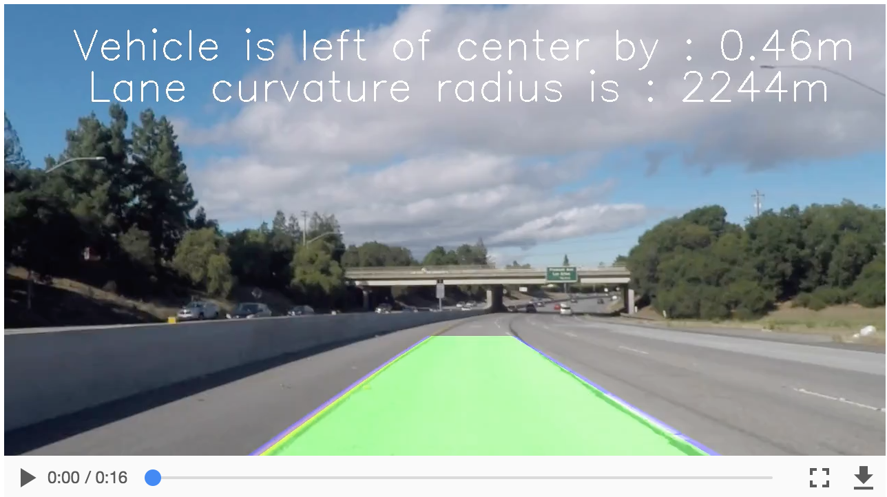

## Writeup for Project


---

**Advanced Lane Finding Project**

The goals / steps of this project are the following:

* Compute the camera calibration matrix and distortion coefficients given a set of chessboard images.
* Apply a distortion correction to raw images.
* Use color transforms, gradients, etc., to create a thresholded binary image.
* Apply a perspective transform to rectify binary image ("birds-eye view").
* Detect lane pixels and fit to find the lane boundary.
* Determine the curvature of the lane and vehicle position with respect to center.
* Warp the detected lane boundaries back onto the original image.
* Output visual display of the lane boundaries and numerical estimation of lane curvature and vehicle position.

[//]: # (Image References)

[image1]: output_images/1.camera_cal_Output/calibration17_out.jpg "Undistorted"
[image2]: output_images/1.camera_cal_Output/calibration11_out.jpg "Undistorted"
[image3]: output_images/2.test_images_Output/straight_lines1_out.jpg	"straight_lines1_out"
[image4]: output_images/2.test_images_Output/test1_out.jpg	"test3_out"
[image5]: output_images/4.binary_thresholds_Output/test3_out.jpg	"BinaryThresholded"
[image6]: output_images/4.binary_thresholds_Output/test5_out.jpg	"BinaryThresholded1"
[image7]: output_images/3.birds_eye_view_Output/test5_out.jpg	"Bird's eye view"
[image8]: output_images/5.color_lanes_Output/test5_out.jpg	"colour view"

---

### Camera Calibration

#### 1. Briefly state how you computed the camera matrix and distortion coefficients. Provide an example of a distortion corrected calibration image.

The code for this step is contained in the **5th** code cell of the IPython notebook [Advanced-Lane-Lines.ipynb](Advanced-Lane-Lines.ipynb).

I start by preparing "object points", which will be the (x, y, z) coordinates of the chessboard corners in the world. Here I am assuming the chessboard is fixed on the (x, y) plane at z=0 (depth), such that the object points are the same for each calibration image.  Thus, `objp` is just a replicated array of coordinates, and `objpoints` will be appended with a copy of it every time I successfully detect all chessboard corners in a test image.  `imgpoints` will be appended with the (x, y) pixel position of each of the corners in the image plane with each successful chessboard detection.  

I used the OpenCV functions **findChessboardCorners** and **drawChessboardCorners** to identify the locations of corners on a chessboard photos in **camera_cal** folder taken from different angles.

I then used the output `objpoints` and `imgpoints` to compute the camera calibration and distortion coefficients using the `cv2.calibrateCamera()` function.  I applied this distortion correction to the test image using the `cv2.undistort()` function and obtained this result:

![alt text][image1]

![alt text][image2]

All output images are in [cameraCalibrationOutput.](output_images/1.camera_cal_Output)

### Pipeline (single images)

#### 1. Provide an example of a distortion-corrected image.

Applied a distortion correction to raw images placed in folder **test_images**.

- Input : calculated camera calibration matrix and distortion coefficients to remove distortion from an image, and

- Output : the undistorted image.

The code is in **7th** cell of [Advanced-Lane-Lines.ipynb](Advanced-Lane-Lines.ipynb).
![alt text][image3]

![alt text][image4]

All output images are in [testImagesOutput.](output_images/2.test_images_Output)


#### 2. Describe how (and identify where in your code) you used color transforms, gradients or other methods to create a thresholded binary image.  Provide an example of a binary image result.

I used a combination of color and gradient thresholds to generate a binary image (thresholding steps in **11th** cell of [Advanced-Lane-Lines.ipynb](Advanced-Lane-Lines.ipynb).  

  - Converted the warped image to different color spaces and created binary thresholded images which highlight only lane lines and ignore everything else.
  - Following color channels were used:
    - 'S' Channel from HLS color space, with a minimum threshold = 180 & max threshold = 255
       - Good: Identifies the white and yellow lane lines,
       - Bad: Did not pick up 100% of the pixels in either one with the tendency to get distracted by shadows on the road.
    - 'L' Channel from LUV color space, with a min threshold = 225 & max threshold = 255,
       - Good: Picks up almost all the white lane lines, but
       - Bad: completely ignores the yellow lines.
    - 'B' channel from the LAB color space, with a min threshold = 155 & max threshold = 200,
       - Good : Identifies the yellow lines much better than S channel, but
       - Bad: Completely ignores the white lines.

   - Created a combined binary threshold based on the above three mentioned binary thresholds.

Here's an example of my output for this step.

![alt text][image5]

![alt text][image6]

All output images are in [binaryThresholdOutput.](output_images/4.binary_thresholds_Output)


#### 3. Describe how (and identify where in your code) you performed a perspective transform and provide an example of a transformed image.

The code for my perspective transform is in **9th code** cell in  [Advanced-Lane-Lines.ipynb](Advanced-Lane-Lines.ipynb), which includes a function called `birds_eye_view()` It takes as inputs an image (`img`) and hardcodes the source (`src`) and destination (`dst`) points.  
- It uses the CV2's **getPerspectiveTransform()** and **warpPerspective()** fns and **undistort()** written as discussed above.
- I hardcoded the source and destination points in the following manner:

    ```python
    source = np.float32([[490, 482],[810, 482],
                      [1250, 720],[40, 720]])
    destination = np.float32([[0, 0], [1280, 0],
                     [1250, 720],[40, 720]])
    ```

I verified that my perspective transform was working as expected by drawing the `src` and `dst` points onto a test image and its warped counterpart to verify that the lines appear parallel in the warped image.

![alt text][image7]

All output images are in [birdsEyeViewOutput.](output_images/3.birds_eye_view_Output)


#### 4. Describe how (and identify where in your code) you identified lane-line pixels and fit their positions with a polynomial?

The code is in **13th code** cell of [Advanced-Lane-Lines.ipynb](Advanced-Lane-Lines.ipynb) and function is named **color_lane()**..

Starting with the combined binary image to isolate only the pixels belonging to lane lines, I fit the polynomial to each lane line, as follows:

- Identified peaks in a histogram of the image to determine location of lane lines.
- Identified all non-zero pixels around histogram peaks using the numpy function numpy.nonzero().
- Fitted polynomial to each lane using the numpy's fn. numpy.polyfit().

With this, I was able to calculate the position of the vehicle w.r.t center with the following calculations:

- Calculated x intercepts avg. from each of the two polynomials position
- Calculated distance from center by taking the abs value of the vehicle's position and subtracting the halfway point along the horizontal axis distance from center.
- If horizontal position of the car was > image_width/2, then car was considered to be on left of center, else right of center.
- Finally, the center distance was converted from pixels to meters by multiplying the number of pixels by 3.7/700.

![alt text][image8]

All output images are in [colorLanesOutput.](output_images/5.color_lanes_Output)

#### 5. Describe how (and identify where in your code) you calculated the radius of curvature of the lane and the position of the vehicle with respect to center.

The code is in **13th code** cell of [Advanced-Lane-Lines.ipynb](Advanced-Lane-Lines.ipynb) and function is named **color_lane()**.

```
# Find radius of curvature for both lane line
xm_per_pix = 3.7/700 # meteres/pixel in x dimension
ym_per_pix = 30.0/720 # meters/pixel in y dimension

left_lane_fit_curvature = np.polyfit(left_y*ym_per_pix, left_x*xm_per_pix, 2)
right_lane_fit_curvature = np.polyfit(right_y*ym_per_pix, right_x*xm_per_pix, 2)
radius_left_curve = ((1 + (2*left_lane_fit_curvature[0]*np.max(left_y) + left_lane_fit_curvature[1])**2)**1.5) \
                             /np.absolute(2*left_lane_fit_curvature[0])
radius_right_curve = ((1 + (2*right_lane_fit_curvature[0]*np.max(left_y) + right_lane_fit_curvature[1])**2)**1.5) \
                                /np.absolute(2*right_lane_fit_curvature[0])
```

#### 6. Provide an example image of your result plotted back down onto the road such that the lane area is identified clearly.

Shown in example above.

---

### Pipeline (video)

#### 1. Provide a link to your final video output.  Your pipeline should perform reasonably well on the entire project video (wobbly lines are ok but no catastrophic failures that would cause the car to drive off the road!).

- Output for : **project_video.mp4**


[](https://youtu.be/IXanFQSjAGU)

- Output for : **challenge_video.mp4**

[](https://youtu.be/Axt0_GvmV7g)

---

### Discussion

#### 1. Briefly discuss any problems / issues you faced in your implementation of this project.  Where will your pipeline likely fail?  What could you do to make it more robust?

- The pipeline developed this project did a real good job in detecting the lane lines for the  [project_video.mp4](https://youtu.be/IXanFQSjAGU) video, which implied that the code worrks well for the known ideal conditions having distinct lane lines, and with not much shadows.

- Code mostly did fine on the [challenge_result.mp4](https://youtu.be/Axt0_GvmV7g) video, with sometimes losing lane lines when heavy shadow was there.

- Code failed miserably on the [harder_challenge_video.mp4](https://github.com/udacity/CarND-Advanced-Lane-Lines/blob/master/harder_challenge_video.mp4). Here the code got exposed in mot being ready on steep curves, and shadows.

In order to make it more robust, I guess I need to go back and revisit the binary channels selection and see if there is any other combination that can help and work fine in shadows and steep curves. Further reading on this topic may help in making the code robust for challenge videos.
